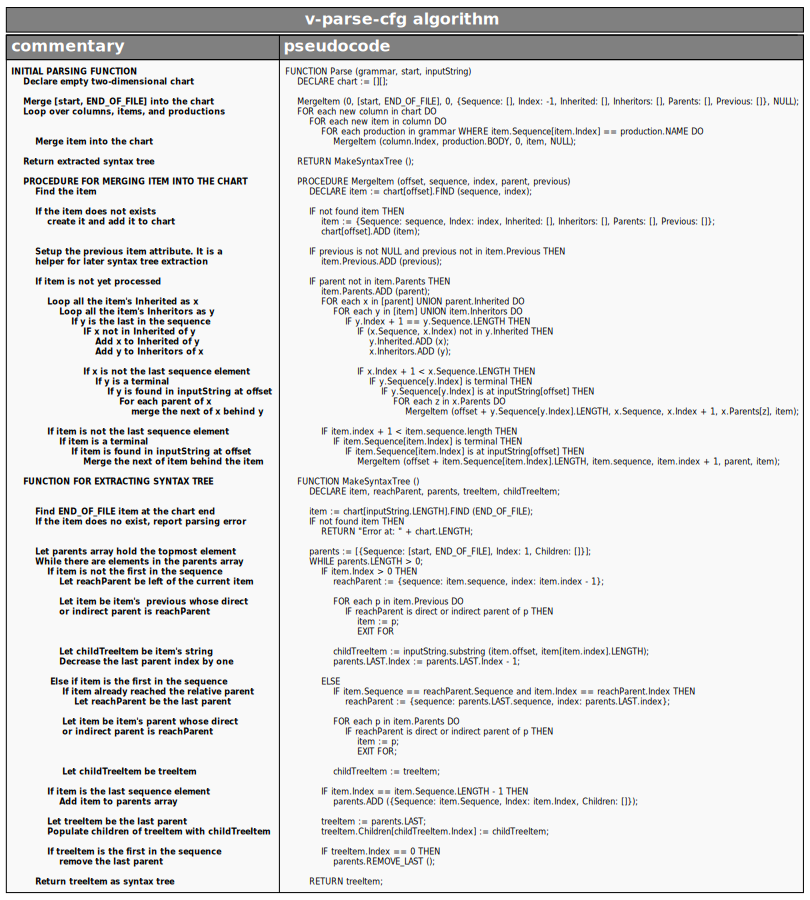

# v-parse-cfg algorithm

*V-parse-cfg* algorithm parses input text against context free grammar rules. The algorithm operates on [context free grammars](https://en.wikipedia.org/wiki/Context-free_grammar). The version of algorithm presented here distinguishes between terminals and non-terminals. It represents a [scannerless parser](https://en.wikipedia.org/wiki/Scannerless_parsing). Here we present the algorithm pseudocode with commentary.

Plain pseudocode in text format can be found in [pseudocode.md](pseudocode.md).

This algorithm is a chart based algorithm that groups parsing items into columns. Columns correspond to offsets from the beginning of input sequence. Columns are incrementally processed, never looking back into the previous columns in the chart. Algorithm stores generated items in the chart as pairs of a sequence and an index of the sequence element. This way it is always possible to know what is ahead element of the current item without looking to back columns. We just increment the index attribute by one, possibly referring to parents of the current item if the index points to the last element.

The main function `Parse` serves as a loop over chart columns and productions. The loop behaves as a [breadth-first search](https://en.wikipedia.org/wiki/Breadth-first_search) to reach all the tokens relative to `start` symbol. It repeatedly calls `MergeItem` procedure to populate the chart onwards. When the parsing is over (there are no additional columns and items in the chart), `Parse` function returns a call to `MakeSyntaxTree` function that composes a parse tree out of the chart.

`MergeItem` procedure creates a new item in appropriate column determined by `offset` only if an item with similar `Sequence` and `Index` attributes doesn't already exist in that column. If the item exists, an array of its direct and indirect parents and children is accumulated. Then the algorithm visits all the existing terminal children in item's `inheritors` attribute, while we pick the next item from all the parents in item's `Inherited` attribute to insert it to the next column of the chart. The next item is thus put on schedule in the chart to be processed by `Parse` function in the future steps.

After parsing, if `END_OF_FILE` element can be found at the first column offset behind the last input token, the parsing is considered successful. If a parsing error occurs, `END_OF_FILE` will not be placed at appropriate place, and the produced chart may be additionally analyzed for errors. Thus, in the case of an error, it may be relatively simple to report `Expected expression ... at offset ...` type of errors by observing only the last populated column in the resulting chart. Additional chart analyzing may be performed for additional parser functionalities.

The algorithm initially produces chart containing all (successful and unsuccessful) attempts in constructing input string. To actually do something meaningful from the algorithm output, we need to convert it to usual syntax tree suitable for further processing. `MakeSyntaxTree` function converts the output chart to such a syntax tree. It starts from the `END_OF_FILE` element, and assembles the tree in backwards manner, towards the uppermost `start` element. In a case of ambiguous successfuly parsed contents, the function outputs the first successful syntax tree regarding to parse rules ordering.

Let's also mention that the entire algorithm exhibits very well behavior regarding to parsing against possibly ambiguous grammars when encountering multiple successful productions for the same input.

